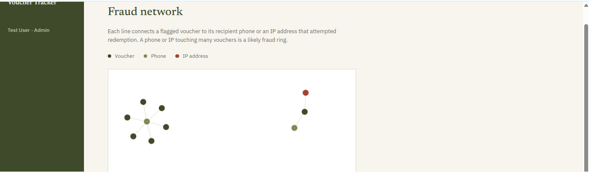

# Voucher Tracker

A secure send-money voucher platform, built to demonstrate the security, fraud-detection, and AI-integration patterns real fintech companies rely on — not just CRUD.

> **The story:** After seeing a real send-money scam pattern circulating (small "bait" vouchers used to test which phone numbers are active before larger fraud attempts), I built the system that actually catches it.

## 🕸️ Fraud Network Graph — the headline feature

Most fraud tools show you a table of flagged transactions. This shows you the *relationships* between them.



Each flagged voucher, its recipient phone, and any IP addresses that attempted redemption become nodes in an interactive graph. A phone number touching multiple unrelated vouchers lights up as an obvious hub — a pattern invisible in a list view but immediate in a graph. Click any node to see its AI-generated fraud explanation inline.

**Why this matters:** identifying fraud *rings* (not just individual bad transactions) is a real problem fraud analysts solve with graph-based tools. This applies that same thinking at a small scale.

## What it does

- **Senders** create vouchers with an amount and recipient phone number, and get a one-time 6-digit PIN to share
- **Recipients** redeem vouchers with the PIN (rate-limited: 3 wrong attempts locks the voucher for review)
- **A background service** scans continuously for two fraud patterns: bait vouchers (multiple small vouchers to one recipient) and duplicate PIN sharing (redemption attempts from multiple IPs)
- **Google Gemini** generates a plain-English explanation for every fraud flag, so a non-technical admin understands *why* something was flagged, not just that it was
- **Admins** review flagged vouchers, read the AI explanation, resolve flags, and explore the fraud network graph

## Security decisions

| Decision | Why |
|---|---|
| PINs hashed with BCrypt, never stored in plaintext | Same principle as password storage — even a database leak doesn't expose usable PINs |
| PINs generated with `RandomNumberGenerator`, not `Random` | `Random` is predictable and unsuitable for anything security-sensitive |
| PIN shown to the sender exactly once, at creation | Minimizes the window where the PIN exists in plaintext anywhere in the system |
| Redemption rate-limited to 3 attempts per voucher | Makes brute-forcing a 6-digit PIN impractical |
| JWT auth with role-based authorization (`Sender` vs `Admin`) | Admin-only endpoints (fraud review, network graph) are enforced server-side, not just hidden in the UI |
| API keys (Gemini) stored via .NET User Secrets, never committed | Standard practice for local dev credentials |

## Tech stack

**Backend:** ASP.NET Core 8 Web API · Entity Framework Core · SQLite · JWT auth · BCrypt.Net
**Frontend:** React (Vite) · react-force-graph-2d · plain CSS design system
**AI:** Google Gemini API (fraud explanation generation)

## Architecture

api/
├── Controllers/ → Auth, Vouchers (create, redeem, admin review, fraud network)
├── Models/ → User, Voucher, RedemptionAttempt, AuditLog, FraudFlag
├── Services/ → PinService, TokenService, AuditService,
│ FraudDetectionService (background job),
│ FraudExplanationService (Gemini integration)
└── Data/ → EF Core DbContext

client/
├── src/pages/ → Login, Register, Dashboard, AdminDashboard, FraudNetwork
├── src/api/ → API client wrapper
└── src/index.css → Design tokens + global styles


## Running it locally

**Backend:**
```bash
cd api
dotnet restore
dotnet ef database update
dotnet user-secrets set "Gemini:ApiKey" "your-key-here"
dotnet run
```

**Frontend:**
```bash
cd client
npm install
npm run dev
```

The API runs on `http://localhost:5137`, the client on `http://localhost:5173`. Swagger UI is available at `/swagger` in development.

## What I'd do next in production

- Real SMS/push notifications instead of the in-app PIN reveal
- Redis-backed rate limiting instead of in-memory counting (for horizontal scaling)
- A proper migration to PostgreSQL/Azure SQL for production data
- ML.NET-based risk scoring as a next step beyond the current rule-based fraud detection
